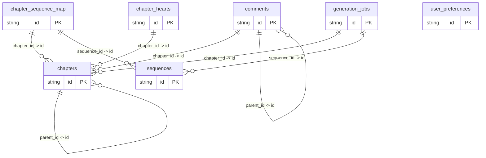

# Database Schema

> Auto-generated from `src/lib/supabase/types.ts`

## chapter_hearts

### Fields

| Field | Type |
|-------|------|
| chapter_id | `string` |
| created_at | `string | null` |
| id | `string` |
| updated_at | `string | null` |
| user_id | `string` |

### Relationships

- **chapter_hearts_chapter_id_fkey** (One-to-Many)
  - **Local columns:** `chapter_id`
  - **References:** `chapters(id)`

## chapter_sequence_map

### Fields

| Field | Type |
|-------|------|
| chapter_id | `string` |
| chapter_index | `number` |
| created_at | `string | null` |
| id | `string` |
| sequence_id | `string` |
| updated_at | `string | null` |

### Relationships

- **chapter_sequence_map_chapter_id_fkey** (One-to-Many)
  - **Local columns:** `chapter_id`
  - **References:** `chapters(id)`

- **chapter_sequence_map_sequence_id_fkey** (One-to-Many)
  - **Local columns:** `sequence_id`
  - **References:** `sequences(id)`

## chapters

### Fields

| Field | Type |
|-------|------|
| author | `string` |
| content | `string` |
| created_at | `string | null` |
| description | `string | null` |
| embedding | `string | null` |
| generation_progress | `number | null` |
| generation_status | `string | null` |
| id | `string` |
| parent_id | `string | null` |
| updated_at | `string | null` |

### Relationships

- **chapters_parent_id_fkey** (One-to-Many)
  - **Local columns:** `parent_id`
  - **References:** `chapters(id)`

## comments

### Fields

| Field | Type |
|-------|------|
| author | `string` |
| chapter_id | `string` |
| content | `string` |
| created_at | `string | null` |
| id | `string` |
| parent_id | `string | null` |
| updated_at | `string | null` |

### Relationships

- **comments_chapter_id_fkey** (One-to-Many)
  - **Local columns:** `chapter_id`
  - **References:** `chapters(id)`

- **comments_parent_id_fkey** (One-to-Many)
  - **Local columns:** `parent_id`
  - **References:** `comments(id)`

## generation_jobs

### Fields

| Field | Type |
|-------|------|
| chapter_id | `string` |
| completed_at | `string | null` |
| created_at | `string | null` |
| current_step | `string | null` |
| error_message | `string | null` |
| id | `string` |
| progress | `number | null` |
| sequence_id | `string | null` |
| started_at | `string | null` |
| status | `string` |
| updated_at | `string | null` |
| user_id | `string | null` |

### Relationships

- **generation_jobs_chapter_id_fkey** (One-to-Many)
  - **Local columns:** `chapter_id`
  - **References:** `chapters(id)`

- **generation_jobs_sequence_id_fkey** (One-to-Many)
  - **Local columns:** `sequence_id`
  - **References:** `sequences(id)`

## sequences

### Fields

| Field | Type |
|-------|------|
| chapters | `Json | null` |
| created_at | `string | null` |
| created_by | `string` |
| description | `string | null` |
| embedding | `string | null` |
| id | `string` |
| is_sexually_explicit | `boolean` |
| name | `string | null` |
| tags | `string[]` |
| title | `string | null` |
| trigger_warnings | `string[]` |
| updated_at | `string | null` |
| user_prompt_history | `Json` |

## user_preferences

### Fields

| Field | Type |
|-------|------|
| created_at | `string | null` |
| id | `string` |
| ignored_trigger_warnings | `string[] | null` |
| story_points | `number` |
| theme | `string | null` |
| updated_at | `string | null` |
| user_id | `string` |
| username | `string` |

## Relationship Diagram

